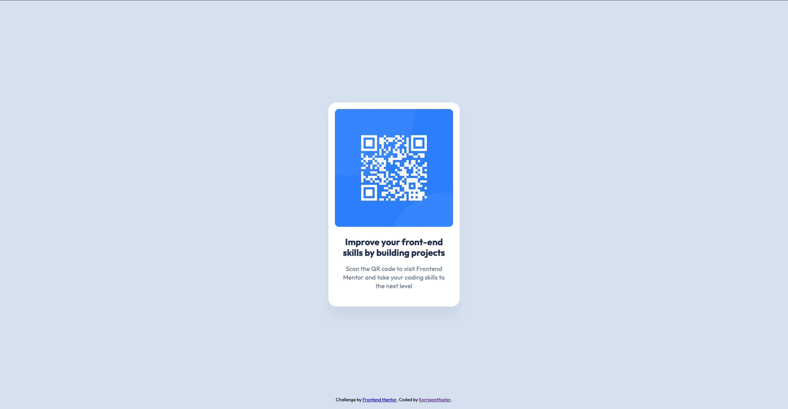

# Frontend Mentor - QR code component solution

This is a solution to the [QR code component challenge on Frontend Mentor](https://www.frontendmentor.io/challenges/qr-code-component-iux_sIO_H). Frontend Mentor challenges help you improve your coding skills by building realistic projects. 

## Table of contents

- [Overview](#overview)
  - [Screenshot](#screenshot)
  - [Links](#links)
- [My process](#my-process)
  - [Built with](#built-with)
  - [What I learned](#what-i-learned)
- [Author](#author)
- [Acknowledgments](#acknowledgments)

**Note: Delete this note and update the table of contents based on what sections you keep.**

## Overview

### Screenshot

### Links

- Solution URL: [GitHub repository](https://github.com/KorriganMaster/qr-code-component)
- Live Site URL: [GitHub page](https://korriganmaster.github.io/qr-code-component/)

## My process

### Built with

- Semantic HTML5 markup
- CSS custom properties
- Flexbox

### What I learned

Better understanding of the Tailwind CSS framework on which I've based my CSS on.

It was also interesting to explore the Figma file to see how it was designed.

## Author

- Frontend Mentor - [@KorriganMaster](https://www.frontendmentor.io/profile/KorriganMaster)

## Acknowledgments

My CSS solution is largely based on [Tailwind CSS](https://tailwindcss.com).
